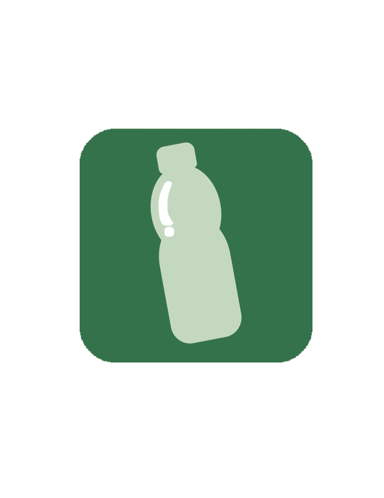

<h1 align="center">WasteWise</h1>

<p align="center">
    
</p>

<p align="center">
    A React Native app that utilizes computer vision and navigation to make proper waste disposal easier.
</p>


## Authors
Sponsor: Mudd Entrepreneurship Studio 2024 

Made with ❤️ by:
* [My Nguyen](https://mynguyen.vercel.app/): Project Manager
* [Terence Chen](https://github.com/TCHEN621130): UI/UX Lead
* [William Koh](https://kohdingjourney.netlify.app/): Lead Developer


### dependencies dump
```
# Docker stuff - 
docker compose up --build -w # to build and to watch
'''

### color hex code dump
##### Light Mode:
Background: #C4D8BF
Text: #2D5A3D
Accents: #82B37A

##### Dark Mode:
Background: #042222
Text: #C4D8BF